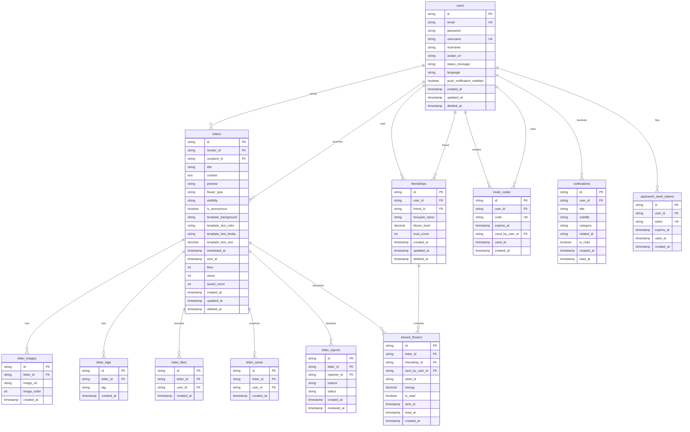

# Taba ERD 다이어그램

## 전체 ERD



## 주요 관계 설명

### 1. 사용자 - 편지 관계
- **users → letters (1:N)**: 한 사용자는 여러 편지를 작성할 수 있음
- **letters → users (N:1)**: 편지는 한 명의 발신자를 가짐
- **letters → users (N:1, nullable)**: DIRECT 편지는 수신자를 가짐

### 2. 편지 - 이미지/태그 관계
- **letters → letter_images (1:N)**: 한 편지는 여러 이미지를 가질 수 있음
- **letters → letter_tags (1:N)**: 한 편지는 여러 태그를 가질 수 있음

### 3. 편지 - 좋아요/저장 관계
- **letters → letter_likes (1:N)**: 한 편지는 여러 좋아요를 받을 수 있음
- **letters → letter_saves (1:N)**: 한 편지는 여러 사용자에게 저장될 수 있음
- **users → letter_likes (1:N)**: 한 사용자는 여러 편지에 좋아요를 누를 수 있음
- **users → letter_saves (1:N)**: 한 사용자는 여러 편지를 저장할 수 있음

### 4. 친구 관계
- **users → friendships (1:N)**: 한 사용자는 여러 친구 관계를 가질 수 있음
- **friendships**: 양방향 관계 (user_id, friend_id)
- **friendships → shared_flowers (1:N)**: 친구 관계는 여러 공유 편지를 가질 수 있음

### 5. 초대 코드
- **users → invite_codes (1:N)**: 한 사용자는 여러 초대 코드를 생성할 수 있음
- **users → invite_codes (1:N)**: 한 사용자는 여러 초대 코드를 사용할 수 있음

### 6. 알림
- **users → notifications (1:N)**: 한 사용자는 여러 알림을 받을 수 있음

## 데이터 흐름

### 편지 작성 및 발송 흐름
```
1. User 작성 → Letter 생성
2. Letter → LetterImages 저장
3. Letter → LetterTags 저장
4. Visibility에 따라:
   - PUBLIC → 하늘에 표시
   - DIRECT → SharedFlower 생성 (Friendship 기반)
   - FRIENDS → 친구들에게 알림
5. Notification 생성 (수신자에게)
```

### 친구 추가 흐름
```
1. User A가 InviteCode 생성
2. User B가 InviteCode 사용
3. Friendship 생성 (양방향)
4. Notification 생성 (양쪽 모두)
```

### 꽃다발 조회 흐름
```
1. User → Friendships 조회
2. 각 Friendship → SharedFlowers 조회
3. SharedFlowers → Letters 조회
4. BloomLevel, TrustScore 계산
```

## 인덱스 전략

### 주요 인덱스
1. **users.email**: 로그인 시 빠른 조회
2. **letters.sender_id, visibility, sent_at**: 공개 편지 목록 조회
3. **shared_flowers.friendship_id, sent_at**: 꽃다발 편지 목록 조회
4. **notifications.user_id, is_read, created_at**: 알림 목록 조회
5. **invite_codes.code, expires_at**: 초대 코드 검증

### 복합 인덱스
- `(letter_id, user_id)` on letter_likes, letter_saves
- `(user_id, friend_id)` on friendships
- `(friendship_id, sent_at)` on shared_flowers
- `(user_id, is_read, created_at)` on notifications

## 성능 최적화 포인트

1. **읽기 최적화**
   - 자주 조회되는 컬럼에 인덱스 생성
   - 페이징 처리
   - 캐싱 (Redis)

2. **쓰기 최적화**
   - 배치 삽입 (이미지, 태그)
   - 비동기 처리 (알림 발송)

3. **소프트 삭제**
   - deleted_at 컬럼 사용
   - 히스토리 보존

4. **파티셔닝 고려사항**
   - letters 테이블: sent_at 기준 월별 파티셔닝 (대량 데이터 시)
   - notifications 테이블: created_at 기준 월별 파티셔닝

